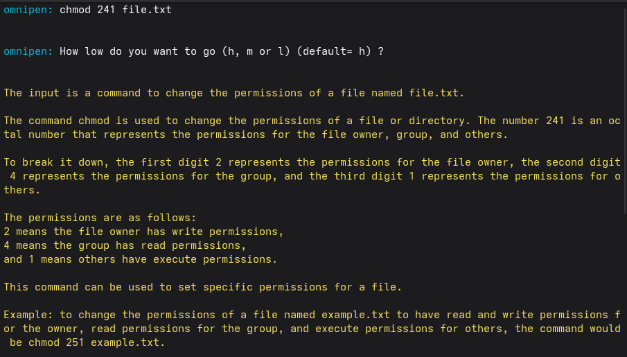
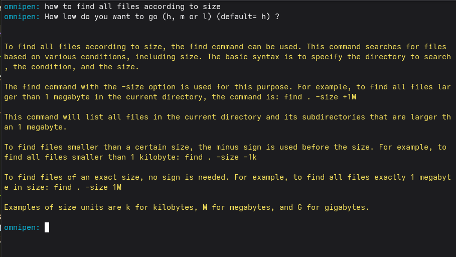

# Introduction

This is a CLI tool that has 2 purposes:

1. Given a command, explain what it does
2. Given something that a user wants to get done, it lists the 
possible commands that could help accomplish that task






## Complexity Levels

There are 3 complexity levels, based on how complex the output is (in terms of information)

| Level | Description |
|-------|-------------|
| `h` | High level, simple description of the command, good for quick lookups |
| `m` | Mid level, describes the command(s) in detail, good for intermediate understanding |
| `l` | Low level, similar to `m`, but has more complexity. Good for understanding internals of Linux environment |

Default option is `h` (high level)

## How it works

On a basic level, it fetches the related man pages from user input (if it can, as the user is free to enter whatever they want), feeds them to a LLM (specifically LLaMA 3.3 70B via [Groq API](https://groq.com) (free tier)), and asks it to generate an explaination. Okay, that's quite literally what it does.

## Setup

### 1. Clone the repo

```bash
git clone https://github.com/rawmeat21/omnipen
cd omnipen
```

### 2. Get a Groq API key

Sign up at [console.groq.com](https://console.groq.com) and generate a free API key.

### 3. Create a `.env` file

```bash
cp .env.example .env
```

Then open `.env` and add your key:

```
OMNIPEN_API_KEY = "your_api_key"
```

### 4. Install dependencies and run

```bash
go mod tidy
go run .
```


